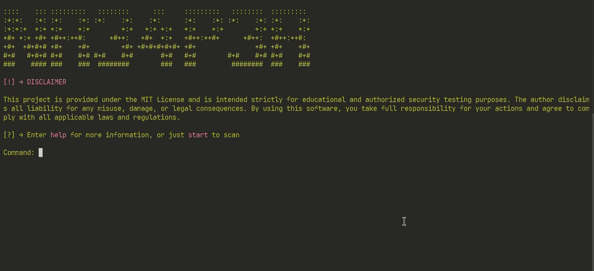

# NR34P3R

[](./LICENSE)
[](https://github.com/m-o-z-z-i-x/NR34P3R/releases)


Fast and powerful port scanner for detecting open ports and services.
Scans hosts with predefined or custom port ranges, revealing active services and their descriptions.

> [!CAUTION]
>
> **Disclaimer:** This project is provided under the **MIT License**
> and is intended **strictly for educational and authorized security testing purposes**.
> The author **disclaims all liability** for any misuse, damage, or legal consequences.
> By using this software, you take full responsibility for your actions and agree to comply with all applicable laws and regulations

<p align="center">
  
</p>

---

## 🚀 Key Features

- **🔀 Multi-threaded scanning** - 100 concurrent threads for blazing fast port checks
- **📚 Service database** - Automatic fetching of 3000+ port descriptions from WikiLess
- **🎨 Colorful terminal UI** - Rich output formatting with Colorama and tqdm progress bars
- **📊 Organized results** - Beautiful Rich tables with port numbers, services and descriptions
- **🛠️ Flexible scanning** - Supports single ports, custom ranges (80-443) and full 1-65535 scans

---

## 🛠️ Using

### Basic Commands:
```bash
start   # Begin scanning
help    # Show documentation
clear   # Reset terminal
exit    # Quit program
```

### Scanning Options:
1. **Target Input**
	- Domain (`example.com`)
	- IP (`192.168.1.1`)

2. **Port Selection**
	- `default`: 34 common ports (HTTP, SSH, MySQL etc.)
	- `1`: Single port mode
	- `2`: Full 1-65535 range
	- `start-end`: Custom range (e.g. 8000-9000)

---

## 🔨 Develop

### 🔧 Requirements

- Python 3.10+
- Essential packages:
  ```bash
  niquests beautifulsoup4 colorama tqdm rich python-dotenv
  ```

### ⚡️ Quick Setup Guide

- **Clone & Open Project**
  ```bash
  git clone https://github.com/m-o-z-z-i-x/NR34P3R.git
  cd NR34P3R
  code .
  ```
- **Set Up Virtual Environment**
  - In VS Code:
    - Open terminal (`Ctrl+~`/`Ctrl+Shift+~`)
    - Run:
      ```bash
      python -m venv .venv
      ```
  - **Restart VS Code terminal** to auto-activate `.venv`
- **Install Dependencies**
  ```bash
  pip install -r requirements.txt
  ```
- **Run**
	```bash
	python main.py
	```

---

## 🌟 Future Roadmap

**Planned improvements**:
- [ ] **🌐 ASN Lookup** - Identify target network ownership
- [ ] **📁 JSON Reports** - Save scan results for later analysis
- [ ] **🚦 Ping Sweep** - Pre-scan host availability check
- [ ] **🔧 Port Test Tool** - Verify specific port configurations

*Suggestions?* [Open an Issue](https://github.com/m-o-z-z-i-x/NR34P3R/issues/new) to discuss new features!

---

## 🤝 Contribution

Contributions are welcome! Here's how to help improve the project:

- **Fork the repository**
- **Create a feature branch**:
  ```bash
  git checkout -b feature/your-feature-name
  ```
- **Commit your changes**:
  ```bash
  git commit -m "Add: your feature description"
  ```
- **Push to your fork**:
  ```bash
  git push origin feature/your-feature-name
  ```
- **Open a Pull Request** to the master branch of this repository

---

## 📈 Repo Activity


---

## 🙏 Support

> ⭐ **Love this project? Give it a star!**

If you find this tool helpful and want to support its development — consider buying me a coffee!

<p align="left">
  <a href="https://yoomoney.ru/to/4100118628464111" target="_blank">
    
  </a>
  <a href="https://boosty.to/m-o-z-z-i-x/donate" target="_blank">
    
  </a>
  <br><br>
  <b>TON Address:</b>
  <blockquote>UQBZVRZFeZI4CepVq_OF5_KiQ_oo62SzmWlGvppfGuyRqUSE</blockquote>
</p>

---

## 📬 Contacts

All my contact links are available [here](https://github.com/m-o-z-z-i-x/m-o-z-z-i-x?tab=readme-ov-file#-contacts)

---

## 📝 License

This project is licensed under the [MIT License](./LICENSE)